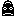
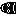
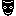

# Kaca

Projekt pri predmetu Digitalno Načrtovanje.

## Ideja

* VGA izhod za prikazovanje slike
* giroskop za premikanje levo, desno, gor in dol
    * premikali bi se lahko tudi z gumbi
* na 7 segmentnem zaslonu bi se izpisovalo število točk (število pojedenih sadežev)
* uporabila bova tudi pomnilne komponente vezja, saj bo potrebno "sliko kače" nekam shraniti

### Dodatno

* naključno generiranje sadežev
* start / end screen
* GAME OVER napis na displayu za točke

## Informacije

Smeri:

| A   | B   | smer                          |
| --- | --- | ----------------------------- |
| 0   | 0   |  desno |
| 0   | 1   |  gor   |
| 1   | 0   |  levo  |
| 1   | 1   |  dol   |

Moduli
* `kaca_engine`
  * skrbi za premik kače, hrani podatke o polju in sadežih
  * opis stanja igre:
    * `1AB` @ X, Y - na X, Y je kača s smerjo `AB`
  * __vhodi__
    * smer_premika = 2-bitni vektor, ki določa smer premika kače (glej zgoraj)
    * allow_snake_move = bit, ki določa, ali se kača lahko premakne (1 = da, 0 = ne)

  * __izhodi__ 
    * spriti
      * 00000 = prazno
      * 001AB = kača spredaj, glej zgoraj za smer
      * 010AB = kača zadaj, glej zgoraj za smer
      * 011AB = kača ovinek: (trenutno še ni implementirano, bolj idejno)
        * |_ = 00
        * _| = 01
        * -| = 10
        * |- = 11
      * 100AB = kača vmes
      * 11111 = sadež
* `index2sprite`
    * preslika index sprita v sprite vektor (dolžine 256 (16 * 16)), ki se ga zatem lahko zapiše na zaslon
    * asinhron
    * __vhodi__
        * sprite index = 'id' sprita, videni zgoraj
    * __izhodi__
        * sprite image bits = vektor 256 bitov (0 = črna, 1 = bela)

* `framebuffer_RAM2`
  * skrbi za preslikavo stanja igre v pixle. Podamo mu želene koordinate, vrne pa nam 1-bitni pixel na tem mestu
  * podpira vpis spritov: podamo mu koordinate in sprite index - ta bo zapisan na "display"
  * __vhodi__
    * sprite index = 'id' sprita, videni zgoraj
    * X, Y koordinate, kamor se sprite zapiše
    * X, Y koordinate, kjer želimo prebrati pixel
  * __izhodi__
    * 1-bitni pixel na X, Y koordinatah, podanih zgoraj
* `kaca_premikalnik`
  * sinhrono kodira premik smeri v dvobitni signal
  * __vhodi__
    * levo, desno, gor, dol (smer iz gyrota or gumb) 
  * __izhodi__
    * smer premika
* `vgaController`
  * prikaže stanje display rama na ekranu. Bere in riše bit po bit iz framebuffer_RAM2
  * hitrost osveževanja zaslona je 60Hz
  * __vhodi__
    * naslov bita na X in Y ter njegova vrednost
  * __izhodi__
    * vsi potrebni VGA signali (VGA_HS, VGA_VS, VGA_R, VGA_G, VGA_B)
* `scoreDisplay`
  * prikazuje število pik (16-tiško) na sedem-segmentnem zaslonu.
  * Ko se igra konča, se na prvih štirih števkah na sekundo izmenjujeta napisa GAME in OVER.
  * __vhodi__
    * trenutni score in signal, ki pove ali smo končali igro
  * __izhodi__
    * signala za prikaz števk in črk; anode in cathode
* `Gyro`
  * Ko vrednost nagiba preseže 70 enot po X ali Y osi, se sproži signal za premik.
  * z napravo (ADXL362) komuniciramo preko SPI protokola
  * izračun premika je zelo kompleksen, saj računa integral spreminjanja pospeška skozi čas.
  * __vhodi__
    * signali iz Akselometera
  * __izhodi__
    * smer zaznanega premika, signali za komunikacijo z Akselometrom

